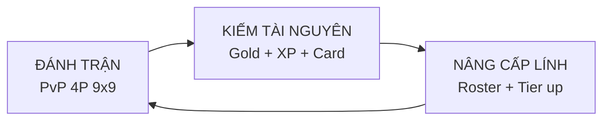

---

# Project Go-Royale — GDD 1-Page

> **Genre:** Tactical Auto-Chess × Battle Royale × Card-Draw
> **Platform:** Mobile-first (iOS/Android), ván 10–15 phút
> **Target:** Casual-Mid Core, game thủ thích chiến thuật ngắn hạn kiểu [[Langrisser]] / [[Fire Emblem]] cổ điển

## 1. High Concept

Bốn người chơi tranh đoạt chiến trường 9×9 theo lượt: mua binh, xếp trận, điều quân, co vòng an toàn, rút thẻ định mệnh — **5 phút học luật, 100 giờ để làm chủ**, lấy cảm hứng từ triết lý *Cờ Vây*.

## 2. Design Pillars

| # | Pillar | Cam kết thiết kế |
|---|---|---|
| **P1** | **Easy to Learn, Hard to Master** | Skill Floor thấp (binh chủng ≤6 loại, luật 1 trang) — [[Skill Ceiling]] cao nhờ không gian vị trí 9×9 × terrain × composition. |
| **P2** | **Skill > Luck** | Chỉ dùng [[Input Randomness]] (map gen, card draw, shop roll) — **KHÔNG** Output Randomness (damage roll, miss-chance). Người chơi luôn biết trước biến số. |
| **P3** | **Bounded Session** | 1 trận ≤ 15 phút. Shrink zone ép tốc độ, tránh stall. |
| **P4** | **Positional Depth** | Mỗi ô cờ là 1 quyết định có ý nghĩa ([[Meaningful Decisions]]). Địa hình random → không có "nước đi tối ưu" cố định. |

## 3. Core Loop

Áp khung [[Vòng lặp Thu - Đánh - Rút]] — **Thu** (Prepare + Draw), **Đánh** (Turn combat), **Rút** (Post-match progression).

## 4. Match Flow — Kết cấu 1 trận đấu

1. **Matchmaking** — Ghép 4 người chơi cùng rank.
2. **Map Generation** — Random bản đồ 9×9 với địa hình ngẫu nhiên (rừng/núi/sông/đồng bằng — tác động movement cost & cover).
3. **Prepare Stage** — Mỗi người nhận **1.000 Gold**, mua binh từ shop, xếp đội hình lên **1/4 bản đồ** của mình (vùng 4×4 ở mỗi góc + ô giữa trung lập).
4. **Turn Loop** (lặp tới khi có người thắng):
   - **Action Points**: Mỗi turn có ngân sách AP; di chuyển/tấn công tiêu AP theo binh chủng & khoảng cách (ô).
   - **Shrink Zone**: Cuối turn, vòng ngoài cùng của bản đồ bị xoá — quân không kịp rút vào vùng an toàn sẽ **bị loại**.
   - **Card Draw**: Đầu turn rút **1 thẻ** ngẫu nhiên (buff tạm thời / tài nguyên / terrain modifier) → tạo [[Input Randomness]] lật kèo, nhưng công khai trước khi chọn nước đi.
5. **Win Condition** — Đội quân duy nhất còn tồn tại trên bản đồ.

## 5. Key Systems

- **Unit Roster (≤6 binh chủng khởi điểm)**: Thiết kế theo [[Intransitive Mechanics]] (kéo–búa–bao) để chống [[Dominant Strategy]]. Ví dụ: Bộ binh > Cung > Kỵ > Bộ binh; Pháp sư counter cụm; Trinh sát rẻ + fast nhưng yếu.
- **Action Points**: Ngân sách cố định/turn. Di chuyển 1 ô = 1 AP (base), tấn công = 2–3 AP, kỹ năng đặc biệt = 4+ AP. Ép người chơi tradeoff cơ động vs sát thương.
- **Shrink Zone**: Mỗi turn co 1 vòng → 9×9 → 7×7 → 5×5 → 3×3. Buộc xung đột tập trung, tránh turtle.
- **Card Deck**: 3 loại thẻ — *Buff* (stat tạm 1-2 turn), *Resource* (gold/AP refund), *Terrain* (đặt/xoá ô địa hình). Rút công khai, chống Output Randomness.
- **Meta Progression**: Giữa trận, thắng/thua → currency → mở roster mới, tier-up binh chủng. Metagame loop wrap quanh tactical loop.

## 6. USP — Khác biệt gì so với thị trường?

| So với | Khác biệt Go-Royale |
|---|---|
| **Auto Chess** (TFT, Dota Underlords) | Có **grid tactical thật** (9×9) + **Battle Royale shrink** thay vì arena cố định. |
| **Fire Emblem / Langrisser cổ điển** | Là **PvP 4-player realtime-turn**, không phải PvE campaign. Có card draw + economy loop. |
| **Battle Royale cổ điển** (PUBG, Fortnite) | Thay vì FPS reflex-based → **tactical cờ theo lượt**, skill ceiling nằm ở tư duy chứ không phải mechanical aim. |

## 7. Open Questions (cần giải quyết ở GDD full)

- [ ] **Turn structure**: Simultaneous-turn (4 người submit cùng lúc) hay sequential? → ảnh hưởng pacing.
- [ ] **AP budget**: Fixed hay scale theo số quân còn sống?
- [ ] **Card economy**: Thẻ có được giữ qua turn, hay dùng-hay-bỏ?
- [ ] **Monetization hook**: Gacha binh chủng? Cosmetic skin? Battle Pass theo season map?
- [ ] **Rejoin/AFK policy**: Với 4P và ván 15 phút, xử lý bỏ trận thế nào?

---

> **Phiên bản:** 1.0
> **Ngày cập nhật:** 2026-04-22
